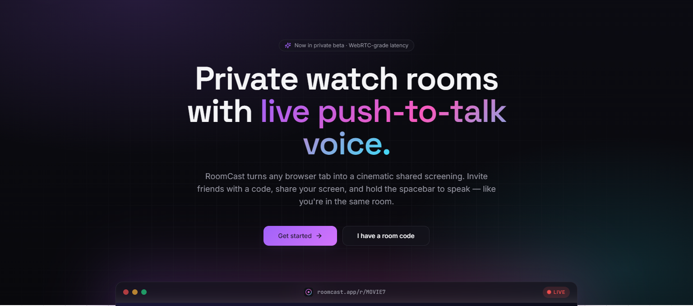
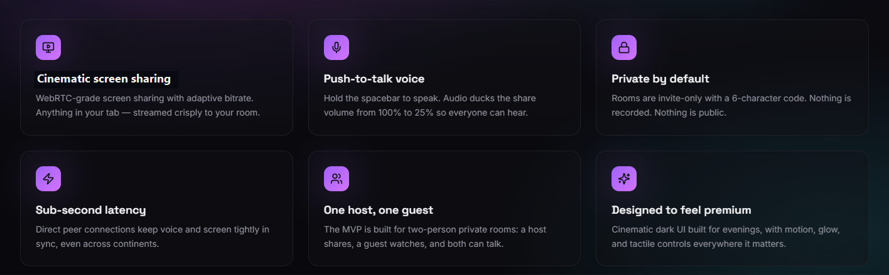

# RoomCast

RoomCast is a private two-person watch room built for simple, low-friction screen sharing. A host creates a room, invites one guest with a short code, and streams their screen directly through WebRTC for a shared viewing experience.

## Features

- Google sign-in for quick, familiar access
- Private two-person rooms for host and guest sessions
- Six-character room codes for easy invites
- Host screen sharing with an in-room preview
- Seamless peer-to-peer streaming powered by WebRTC
- Firestore-backed signaling for fast room connection setup
- Push-to-talk voice so viewers can talk without drowning out the shared media
- Automatic room lifecycle handling when sessions end
- Clean theater-style viewing interface
- No mock room history or fake stored watch activity

## WebRTC Streaming

RoomCast uses WebRTC to move live screen and audio streams directly between the host and guest whenever possible. Firebase handles authentication, room creation, and signaling, while the actual media experience is peer-to-peer for lower latency and a more natural watch-room feel.

The host can share a browser tab, window, or screen, and the guest receives the live stream inside the RoomCast room. The host also sees a local preview of what is being shared, making it easier to keep the viewing session coordinated.

## Experience

RoomCast is designed around a focused flow:

1. Sign in with Google.
2. Name a room.
3. Share the room code or invite link.
4. Start screen sharing.
5. Watch together with push-to-talk voice.

## Notes

RoomCast works best with content that browsers allow to be captured, such as presentations, owned media, non-DRM browser tabs, and compatible video sources. Some protected streaming platforms may block screen capture at the browser or operating-system level.

## License

MIT
